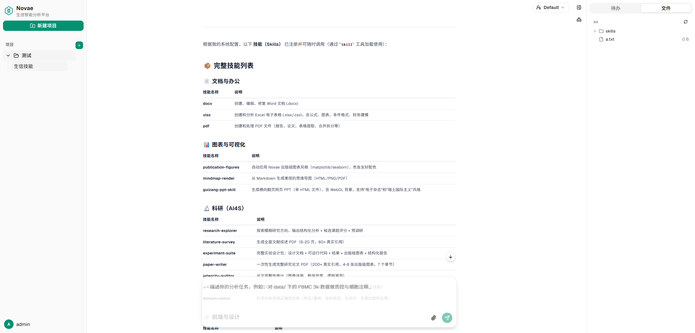
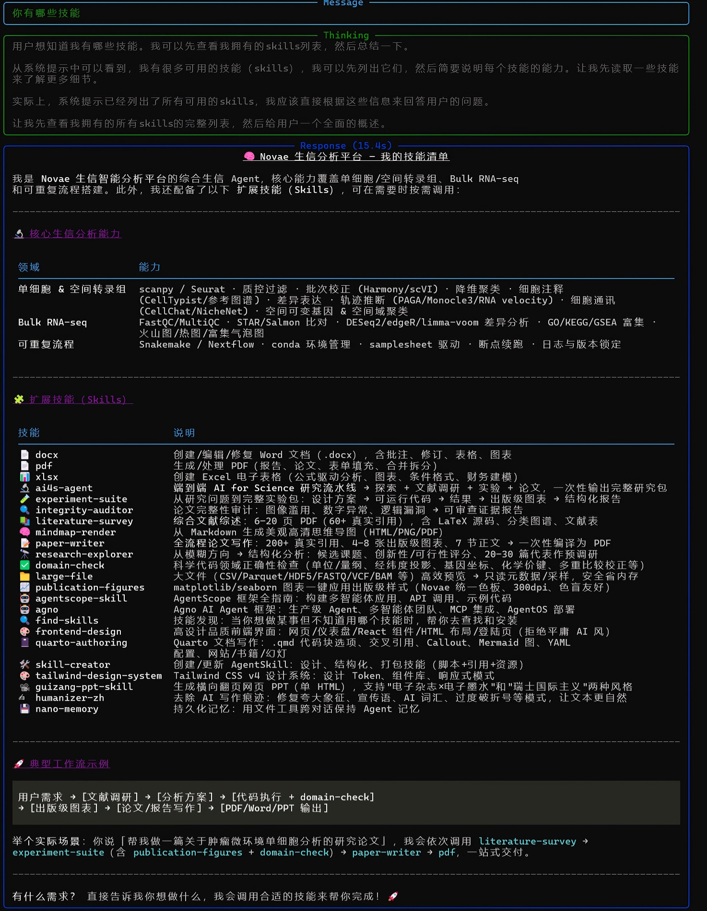

# Novae

<p align="center">
  
</p>

<p align="center">
  基于 <a href="https://docs.agentscope.io/">AgentScope</a> 的智能编程助手，为你的开发工作流注入 AI 驱动的自动化能力。
</p>

<p align="center">
  <a href="#-快速开始">快速开始</a> •
  <a href="#-功能特性">功能特性</a> •
  <a href="#-使用方式">使用方式</a> •
  <a href="#-配置说明">配置说明</a>
</p>

---

## ✨ 功能特性

| 功能 | 描述 |
|------|------|
| **智能对话** | 基于大模型的上下文理解，支持多轮对话 |
| **技能系统** | 可扩展的技能插件，按需加载专业能力 |
| **MCP 工具扩展** | 内置文献检索（paper-search）与生物医学数据库（biomcp），支持自定义 MCP 服务器 |
| **Web UI** | 响应式前端界面，支持终端与 Web 双端交互 |
| **用户管理** | 基于 Redis 的用户认证与权限控制 |
| **会话持久化** | 对话历史自动保存，支持断点续聊 |

---

## 🚀 快速开始

### 前置依赖

- **Python ≥ 3.13**（推荐使用 [uv](https://docs.astral.sh/uv/)）
- **Node.js ≥ 20**
- **Redis**（本地或 Docker）

```bash
# 快速启动 Redis
docker run -d -p 6379:6379 redis:7
```

### 安装

```bash
# 克隆仓库
git clone https://github.com/your-username/novae.git
cd novae

# 配置环境
cp .env.example .env
# 编辑 .env 填入你的模型 API Key

# 安装依赖
uv sync
```

---

## 💻 使用方式

### 命令行模式

终端直接交互，适合快速提问：

```bash
uv run novae chat "你有哪些技能"
```

<p align="center">
  
</p>

```bash
uv run novae chat "用 paper-search 查两篇 TP53 近期文献"
```

### Web UI 模式

启动完整的 Web 服务：

```bash
# 终端 1：启动后端
uv run fastapi dev src/novae/server.py

# 终端 2：启动前端
cd frontend
npm install
npm run dev
```

然后访问 http://localhost:5173

---

## 👤 用户管理

```bash
# 开发人员创建用户，也可以使用 web 端用户管理页面
uv run python scripts/create_user.py <用户名> <密码> [user|admin]
```

用户数据存储在 Redis 的 `novae:user:<username>` 键下，密码通过 PBKDF2-HMAC-SHA256 哈希存储，保障安全性。

---

## 🔌 MCP 服务器（工具扩展）

Novae 通过 [MCP](https://modelcontextprotocol.io/)（Model Context Protocol）为 Agent 接入外部工具服务器。MCP 在**每个项目工作区初始化时播种**，配置持久化于 `<工作区>/.mcp`；连接失败的服务器会被自动移除（仅记警告，绝不阻断对话主流程）。界面上（项目工作区抽屉 → MCP）可按项目查看、新增与删除。

### 内置服务器

| 名称 | 启动命令 | 工具规模 | 覆盖范围 |
|------|----------|----------|----------|
| **paper-search** | `uv tool run paper-search-mcp` | 57 个工具 | arXiv、PubMed、Crossref、Semantic Scholar、bioRxiv/medRxiv、Google Scholar 等文献检索与下载 |
| **biomcp** | `uv tool run --from biomcp-python biomcp run` | 36 个工具 | PubMed 文章、ClinicalTrials.gov 临床试验、MyVariant/ClinVar 变异与基因注释 |

> **前置要求**：系统可执行 `uv`（本项目即经 uv 运行；首次启动 MCP 会自动下载依赖，需联网）。启动命令使用 `uv tool run` 而非 `uvx`——后者是独立分发的二进制，部分环境不存在。

### 自定义：`NOVAE_MCP_SERVERS`

在 `.env` 中设置 JSON 数组，**完全替换**默认列表（设为 `[]` 即全部禁用）：

```bash
# stdio 传输（本地进程）
NOVAE_MCP_SERVERS='[{"name": "paper-search", "command": "uv", "args": ["tool", "run", "paper-search-mcp"], "env": {}}]'

# HTTP 传输（远程服务）
NOVAE_MCP_SERVERS='[{"name": "zotero", "url": "http://localhost:3001/sse", "headers": {}}]'
```

数组元素字段说明：

- `name`（必填）：服务器标识，只允许字母、数字、`_`、`-`；
- stdio：`command` + 可选 `args` / `env` / `cwd`；
- HTTP：`url` + 可选 `headers`；
- 解析失败的条目会被跳过并记警告，不影响其余条目与整体启动。

### 排障

- 聊天中看不到 MCP 工具：查看后端日志中 `Failed to connect stateful MCP` 警告，先确认 `uv` 可用、网络可下载对应包；
- 历史工作区的 `.mcp` 若曾被误清空，启动时的一次性迁移（`.mcp_repair_v1` 标记）会自动补回内置服务器，且不会复活你主动删除的条目。

### CLI 与内置 Web 工具

- CLI（`uv run novae chat "..."`）会在启动对话前自动连接内置 MCP，连接失败的记警告并跳过；
- 除 MCP 外，agent 还内置两个自定义 Web 工具（服务端与 CLI 均生效）：
  - `websearch`：通用网页搜索——配置 `TAVILY_API_KEY`（可选）走 Tavily，否则用 DuckDuckGo（无需密钥）；
  - `webfetch`：抓取网页正文（主内容抽取，自动去导航/广告，超长截断）。
- 分工约定：学术文献/生物医学数据优先走 MCP（paper-search / biomcp），通用网络信息走 `websearch` / `webfetch`。

---

## 📁 项目结构

```
novae/
├── src/novae/          # 核心代码
├── frontend/           # React + Vite 前端
├── scripts/            # 脚本工具
├── images/             # 文档图片
└── .env.example        # 环境变量模板
```

---

## 📄 License

MIT License

